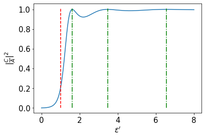

# トンネル効果
小出昭一郎, 量子力学（I）p119 §5.3  「トンネル効果」について。p123に書かれているように、途中の計算が省かれていて、読者の演習に任されている。これについて$\varepsilon<V_0$の場合のポテンシャルの壁を乗り越えていく波の振幅(具体的には振幅$C$)について計算してみる。これは壁の左側の波動のエネルギー$\varepsilon$よりポテンシャルの壁$V_0$が大きいので、自身のエネルギーより高いポテンシャルの壁を乗り越えていく、**トンネル効果**の透過後の振幅を計算することになる。

いつものごとく式番号はこの参考書と同じ。細かい点は飛ばすのでこの参考書を見ながら読んでほしい。

## 支配方程式

シュレディンガー方程式
$$
\left(
-\frac{\hbar^2}{2m}
\frac{\partial^2}{\partial x^2}
+V(x)
\right)\psi (x,t)
=i\hbar\frac{\partial}{\partial t}\psi(x,t)\tag{2}
$$
ここで定常状態を考え、
$$
\psi(x,t)=e^{-i\omega t}\varphi(x)\tag{3}
$$
とすると、
$$
\left(
-\frac{\hbar^2}{2m}
\frac{\partial^2}{\partial x^2}
+V(x)
\right)\varphi (x)
=\varepsilon\varphi(x)\tag{4}
$$
$$
\varepsilon=\hbar\omega\tag{5}
$$
となる。
## ポテンシャルの壁

$$
\begin{aligned}
V(x)&=0\hspace{20pt}x<0,\hspace{10pt}x>a\\
V(x)&=V_0\hspace{17pt}0<x<a
\end{aligned}\tag{1}
$$
$x<0,x>a$の区間については、$V(x)=0$より、シュレディンガー方程式は
$$
-\frac{\hbar^2}{2m}
\frac{\partial^2}{\partial x^2}\varphi (x)
=\varepsilon\varphi(x)\tag{7}
$$
となり、左から粒子が飛んでくることを考えると、
$$
\begin{aligned}
\varphi(x)&=Ae^{ikx}+Be^{-ikx}\hspace{20pt}x<0\\
\varphi(x)&=Ce^{ikx}\hspace{62pt}x>a
\end{aligned}\tag{6}
$$
で
$$
\varepsilon=\frac{\hbar^2}{2m}k^2\tag{8}
$$
となる。

## 1. $\varepsilon>V_0$のとき
これについては参考書に途中の連立方程式まで導かれているので導出は飛ばす。結果は
$$
\left|\frac{C}{A}\right|^2
=\left[
    1+\frac{V_0^2 \sin^2{\kappa a}}{4\varepsilon(\varepsilon-V_0)}
\right]^{-1}\tag{13b}
$$
である。

## 2. $\varepsilon<V_0$のとき

$$
\left(
-\frac{\hbar^2}{2m}
\frac{\partial^2}{\partial x^2}
+V_0
\right)\varphi (x)
=\varepsilon\varphi(x)
$$
変形して
$$
\frac{\partial^2}{\partial x^2}\varphi(x)
=\frac{2m}{\hbar^2}
\left(
V_0-\varepsilon
\right)
\varphi(x)
$$
ここで
$$
\alpha=\sqrt{\frac{2m}{\hbar^2}
\left(
V_0-\varepsilon
\right)}
$$
とすると、
$$
\varphi''(x)-\alpha^2\varphi(x)=0
$$
となるので、
$$
\varphi(x)=Fe^{\alpha x}+Ge^{-\alpha x}
$$

### 振幅の導出
連続でなめらかなことから、
#### $x=0$の点で
連続なことから
$$
\begin{aligned}
\varphi(0)&=A+B\hspace{20pt}x<0\\
\varphi(0)&=F+G\hspace{20pt}x>0
\end{aligned}
$$
より
$$
A+B=F+G
$$

なめらかなことから
$$
\begin{aligned}
\varphi'(0)&=ikA-ikB\hspace{20pt}x<0\\
\varphi'(0)&=\alpha F-\alpha G\hspace{25pt}x>0
\end{aligned}
$$
より
$$
ikA-ikB=\alpha F-\alpha G
$$

#### $x=a$の点で
連続なことから
$$
\begin{aligned}
\varphi(a)&=Ce^{ika}\hspace{55pt}x>a\\
\varphi(a)&=Fe^{\alpha a}+Ge^{-\alpha a}\hspace{20pt}x<a
\end{aligned}
$$
より
$$
Ce^{ika}=Fe^{\alpha a}+Ge^{-\alpha a}
$$

なめらかなことから
$$
\begin{aligned}
\varphi'(a)&=ikCe^{ika}\hspace{20pt}x<0\\
\varphi'(a)&=\alpha Fe^{\alpha a}-\alpha Ge^{-\alpha a}\hspace{25pt}x>0
\end{aligned}
$$
より
$$
ikCe^{ika}=\alpha Fe^{\alpha a}-\alpha Ge^{-\alpha a}
$$

#### まとめ

$$
\begin{aligned}
&A+B=F+G\\
&ikA-ikB=\alpha F-\alpha G\\
&Ce^{ika}=Fe^{\alpha a}+Ge^{-\alpha a}\\
&ikCe^{ika}=\alpha Fe^{\alpha a}-\alpha Ge^{-\alpha a}
\end{aligned}
$$
ここで
$$
\begin{aligned}
&b=\frac{B}{A},\hspace{10pt}
c=\frac{C}{A},\hspace{10pt}
f=\frac{F}{A},\hspace{10pt}
g=\frac{G}{A}\\
&c'=ce^{ika},\hspace{10pt}
k'=ik,\hspace{10pt}
E=e^{\alpha a}
\end{aligned}
$$
と置くと、振幅比についての連立方程式、
$$
\begin{aligned}
&1+b=f+g \\
&k'-k'b=\alpha f-\alpha g\\
&c'=fE+g/E\\
&k'c'=\alpha fE-\alpha g/E
\end{aligned}
$$
が得られる。

### 振幅比について解く
式(1)から
$$
b=f+g-1
$$
式(2)に代入
$$
\begin{aligned}
&k'-k'f-k'g+k'=\alpha f-\alpha g\\
&(\alpha-k')g=-2k'+(\alpha+k')f
\end{aligned}
$$
よって
$$
g=\frac{-2k'+(\alpha+k')f}{\alpha-k'}
$$
式(3)に代入
$$
\begin{aligned}
c'&=fE+\frac{-2k'+(\alpha+k')f}{(\alpha-k')E}\\
&=\frac{-2k'}{(\alpha-k')E}+
\frac{
(\alpha-k')E+(\alpha+k')E^{-1}
}{\alpha-k'}
f
\end{aligned}
$$
ここで
$$
J_1=(\alpha-k')E,\hspace{20pt}J_2=(\alpha+k')E^{-1}
$$
と置くと、
$$
\frac{J_1+J_2}{\alpha-k'}f=c'+\frac{2k'}{J_1}
$$
$$
\begin{aligned}
f&=\frac{\alpha-k'}{J_1+J_2}
\left(
c'+\frac{2k'}{J_1}
\right)\\
&=\frac{\alpha-k'}{J_1+J_2}c'+\frac{2k'}{(J_1+J_2)E}
\end{aligned}
$$
また
$$
\begin{aligned}
g&=\frac{-2k'}{\alpha-k'}+
\frac{\alpha+k'}{\alpha-k'}\left[
\frac{\alpha-k'}{J_1+J_2}c'+\frac{2k'}{(J_1+J_2)E}
\right]\\
&=\frac{-2k'}{\alpha-k'}+
\frac{\alpha+k'}{J_1+J_2}c'
+\frac{2k'(\alpha+k')}{(J_1+J_2)(\alpha-k')E}\\
&=\frac{\alpha+k'}{J_1+J_2}c'
+\frac{-2k'E}{J_1}
+\frac{2k'EJ_2}{(J_1+J_2)J_1}\\
&=\frac{\alpha+k'}{J_1+J_2}c'
-\frac{2k'E}{J_1+J_2}
\end{aligned}
$$
式(4)に代入
$$
\begin{aligned}
&k'c'=\alpha E
\left[
\frac{\alpha-k'}{J_1+J_2}c'+\frac{2k'}{(J_1+J_2)E}
\right]
-\alpha E^{-1}
\left[
\frac{\alpha+k'}{J_1+J_2}c'-\frac{2k'E}{J_1+J_2}
\right]\\
&(J_1+J_2)k'c'=\alpha E
\left[
    (\alpha-k')c'+2k'E^{-1}
\right]
-\alpha E^{-1}
\left[
    (\alpha+k')c'-2k'E
\right]\\
&(J_1+J_2)k'c'
=\alpha(J_1 c'+2k')
-\alpha(J_2 c'-2k')\\
&(J_1+J_2)k'c'
=\alpha
\left[
    (J_1 -J_2)c'+4k'
\right]\\
&[(J_1+J_2)k'+(J_2-J_1)\alpha]c'=4k'\alpha
\end{aligned}
$$

$$
\begin{aligned}
(J_1+J_2)k'+(J_2-J_1)\alpha&=J_1(k'-\alpha)+J_2(k+\alpha)\\
&=-(k'-\alpha)^2E+(k'+\alpha)^2E^{-1}
\end{aligned}
$$
よって
$$
c'=\frac{4k'\alpha}{(k'+\alpha)^2E^{-1}-(k'-\alpha)^2E}
$$

### 振幅の比の絶対値
いよいよトンネル効果の振幅比を計算する。
$$
|c'|^2=c'^*c'=c^*e^{-ika}ce^{ika}=c^*c=|c|^2
$$
より

$$
\begin{aligned}
|c|^2&=|c'|^2\\
&=\frac{4k'^*\alpha}{(k'^*+\alpha)^2E^{-1}-(k'^*-\alpha)^2E}
\frac{4k'\alpha}{(k'+\alpha)^2E^{-1}-(k'-\alpha)^2E}\\
&=\frac{16k^2\alpha^2}
{\left[
    (\alpha-ik)^2E^{-1}-(\alpha+ik)^2E
\right]
\left[
    (\alpha+ik)^2E^{-1}-(\alpha-ik)^2E
\right]}\\
&=\frac{16k^2\alpha^2}
{
(\alpha^2+k^2)^2E^{-2}-(\alpha-ik)^4-(\alpha+ik)^4+(\alpha^2+k^2)^2E^2
}
\end{aligned}
$$
この式の分母について
$$
\begin{aligned}
&(\alpha^2+k^2)^2E^{-2}-(\alpha-ik)^4-(\alpha+ik)^4+(\alpha^2+k^2)^2E^2\\
=&(\alpha^2+k^2)^2(E^2+E^{-2})-2\alpha^2+12\alpha^2k^2-2k^4\\
=&(\alpha^2+k^2)^2(E^2+E^{-2})-2(\alpha^2+k^2)^2+16\alpha^2k^2\\
=&(\alpha^2+k^2)^2(E^2-2+E^{-2})+16\alpha^2k^2\\
=&(\alpha^2+k^2)^2(E-E^{-1})^2+16\alpha^2k^2
\end{aligned}
$$
となる。よって
$$
\begin{aligned}
|c|^2=&\left[
\frac{(\alpha^2+k^2)^2(E-E^{-1})^2+16\alpha^2k^2}{16k^2\alpha^2}
\right]^{-1}\\
=&\left[
1+
\frac{(\alpha^2+k^2)^2(E-E^{-1})^2}{16k^2\alpha^2}
\right]^{-1}
\end{aligned}
$$
また
$$
k^2=\frac{2m}{\hbar^2}\varepsilon,\hspace{20pt}
\alpha^2=\frac{2m}{\hbar^2}(V_0-\varepsilon),\hspace{20pt}
\sinh x=\frac{e^x-e^{-x}}{2}
$$
より
$$
\begin{aligned}
&\alpha^2+k^2=
\frac{2m}{\hbar^2}V_0,\hspace{20pt}\\
&k^2\alpha^2=\left(
    \frac{2m}{\hbar^2}
\right)^2\varepsilon(V_0-\varepsilon)\\
&E-E^{-1}=e^{\alpha a}-e^{-\alpha a}=2\sinh \alpha a
\end{aligned}
$$
なので、
$$
\begin{aligned}
\left|\frac{C}{A}\right|^2=&\left[
1+
\frac{4
\left(
    \frac{2m}{\hbar^2}
\right)^2
V_0^2\sinh^2\alpha a}{16
\left(
    \frac{2m}{\hbar^2}
\right)^2
\varepsilon(V_0-\varepsilon)}
\right]^{-1}\\
=&\left[
1+
\frac{
V_0^2\sinh^2\alpha a}{
4\varepsilon(V_0-\varepsilon)}
\right]^{-1}
\end{aligned}\tag{13b'}
$$
が得られる。これは参考書p124の式(13b)'と一致する。この後のグラフの図示のために
$$
\varepsilon'=\frac{\varepsilon}{V_0}
$$
とすると、
$$
\begin{aligned}
\left|\frac{C}{A}\right|^2=&\left[
1+
\frac{
\sinh^2\alpha a}{
4\varepsilon'(1-\varepsilon')}
\right]^{-1}
\end{aligned}
$$
となる。また、
$$
\frac{ma^2}{\hbar^2}V_0=8
$$
として式(13b)'の$\sinh^2\alpha a$の中の$\alpha a$を計算しておくと、
$$
\begin{aligned}
\alpha a&=a\sqrt{\frac{2m}{\hbar^2}(V_0-\varepsilon)}\\
&=\sqrt{\frac{2ma^2}{\hbar^2}V_0(1-\varepsilon')}\\
&=4\sqrt{1-\varepsilon'}
\end{aligned}
$$
よって
$$
\begin{aligned}
\left|\frac{C}{A}\right|^2=&\left[
1+
\frac{
\sinh^2 4\sqrt{1-\varepsilon'}}
{4\varepsilon'(1-\varepsilon')}
\right]^{-1}
\end{aligned}
$$
### 極限
#### $\varepsilon'\to 0$のとき
$$
\begin{aligned}
\lim_{\varepsilon'\to 0}\left|\frac{C}{A}\right|^2
&=\lim_{\varepsilon'\to 0}\left[
1+
\frac{
\sinh^2 4\sqrt{1-\varepsilon'}}
{4\varepsilon'(1-\varepsilon')}
\right]^{-1}\\
&=0
\end{aligned}
$$
#### $\varepsilon'\to 1$のとき
$$
4\sqrt{1-\varepsilon'}=\beta
$$
とおくと、
$$
1-\varepsilon'=\frac{\beta^2}{16}
$$
$$
\begin{aligned}
\frac{
\sinh^2 4\sqrt{1-\varepsilon'}}
{4\varepsilon'(1-\varepsilon')}
&=4\frac{\sinh^2 \beta}
{(1-\beta^2/16)\beta^2}\\
&=\frac{4}{1-\beta^2/16}
\left(
\frac{\sinh \beta}
{\beta}
\right)^2
\end{aligned}
$$
$\varepsilon'\to1$のとき$\beta\to0$で、なおかつ、
$$
\lim_{\beta\to0}\frac{\sinh \beta}
{\beta}=1
$$
だから、
$$
\begin{aligned}
\lim_{\varepsilon'\to 1}\left|\frac{C}{A}\right|^2
&=\lim_{\varepsilon'\to 1}
\left[
1+
\frac{
\sinh^2 4\sqrt{1-\varepsilon'}}
{4\varepsilon'(1-\varepsilon')}
\right]^{-1}\\
&=\lim_{\beta\to 0}
\left[
1+
\frac{4}{1-\beta^2/16}
\left(
\frac{\sinh \beta}
{\beta}
\right)^2
\right]^{-1}\\
&=(1+4)^{-1}\\
&=\frac{1}{5}
\end{aligned}
$$

### 実は$\varepsilon>V_0$の場合と式は同じ

$\varepsilon>V_0$のときは
$$
\left|\frac{C}{A}\right|^2
=\left[
    1+\frac{V_0^2 \sin^2{\kappa a}}{4\varepsilon(\varepsilon-V_0)}
\right]^{-1}
$$
であったが、
$$
\kappa a=4\sqrt{\varepsilon'-1}
$$
だから
$$
\left|\frac{C}{A}\right|^2
=\left[
    1+\frac{\sin^2{4\sqrt{\varepsilon'-1}}}{4\varepsilon'(\varepsilon'-1)}
\right]^{-1}
$$
となるが、実はこれは式(13b)'で、
$$
\sinh{x}=-i\sin{ix}
$$
とすれば導くことができる。よって虚数が表に出ないように別の式にしているだけで$\varepsilon>V_0$の場合も、$\varepsilon<V_0$の場合も実は同じ式で表せる。

## 振幅比が1となる$\varepsilon'$
$$
\kappa a=n\pi
$$
で
$$
\left|\frac{C}{A}\right|^2=1
$$
となるが、このとき、
$$
\varepsilon'=\frac{n^2\pi^2}{16}+1
$$

## 図示
$$
\frac{ma^2}{\hbar^2}V_0=8
$$
の場合について透過率($|C/A|^2$)を図示する。
$$
\begin{aligned}
\left|\frac{C}{A}\right|^2=
\left\{
\begin{matrix}
0
& \varepsilon'=0\\
\left[
    1+\frac{\sinh^2 4\sqrt{1-\varepsilon'}}
    {4\varepsilon'(1-\varepsilon')}
\right]^{-1} 
& 0<\varepsilon'<1\\
\frac{1}{5}
&\varepsilon'=1\\
\left[
    1+\frac{\sin^2{4\sqrt{\varepsilon'-1}}}
    {4\varepsilon'(\varepsilon'-1)}
\right]^{-1} 
& \varepsilon'>1
\end{matrix}
\right.
\end{aligned}
$$
を$0\le\varepsilon'\le8$で図示する
$$
\varepsilon'=1
$$
$$
\left|\frac{C}{A}\right|^2=1\quad\therefore\varepsilon'=\frac{n^2\pi^2}{16}+1
$$
となる直線も同時に示す。

$\varepsilon'<1$でも振幅比が0以上となり、粒子の存在確率が漏れ出ている事がわかる。これがトンネル効果である。