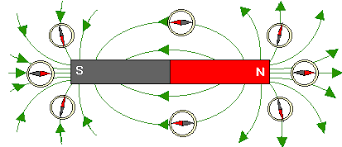

# スピン軌道相互作用
Spin–orbit interaction

## 磁気モーメントのエネルギー

電荷は互いに力を及ぼす。その力Fはクーロンの法則で決まる。
ベクトル場である電場$\pmb{E}$に$q$をかけることでその電荷が感じる力$\pmb{F}$を求めることができる。
一方、一般的に、力$\pmb{F}$はスカラー場のポテンシャル$G$によって$\pmb{F}=-\nabla G$と求めることができる。
電場にとって、このポテンシャル$G$に当たるものが、静電ポテンシャル、電位と呼ばれる$\phi$で、$\pmb{E}=-\nabla \phi$となる。
よって電位は、位置について微分して、$q$をかけると力になる。

電気双極子については
[【電磁気学】電気双極子](https://www.youtube.com/watch?v=m_LFq8bxFNE)
微小な距離離れた$+q$、$-q$電荷が作る電位を導出する、電場を出す。その課程で電気双極子モーメント$\pmb{q}$が自然に導入される。

磁気モーメントについては
[磁気モーメント](https://eman-physics.net/electromag/magnetic_moment.html)
磁気の場合、電気とは違い、$+m$を持ったモノポールは存在しないので、微小な円形電流が作る磁場と電気双極子の作る電場の式を比べ、磁気モーメントを導入する。

電場中の電気双極子のエネルギーの導出過程は
[外場中の双極子モーメントのエネルギー（U=-p•Eの話）](https://batapara.com/archives/dipople-in-external-field.html/)
を参考にする。
(電場中の少し傾いた電気双極子のエネルギーを考える)

電気双極子は$-$から$+$の方向のベクトル
磁気モーメントは$S$から$N$方向のベクトル

上のことを確認すれば、磁場$\pmb{B}$中の磁気モーメント$\pmb{\mu}$のエネルギーは
$-\pmb{\mu}\cdot\pmb{B}$

となることが分かる。

例えば、図のように方位磁針の場合、磁場の向きと磁気モーメント向きが一致したとき安定(エネルギー小)

電子の場合、負電荷なので、スピンの向き$\pmb{s}$とと磁気モーメントの向きは逆。
つまりスピンの向きと磁場の向きが逆になったとき安定(エネルギー小)

よってスピン軌道相互作用によるエネルギーは
$\zeta (\pmb{l}\cdot\pmb{s})$と表せられる。

## エネルギーの分裂

単純な水素原子のモデルのように、このスピン軌道相互作用によるエネルギーを考えない場合は同じ主量子数の状態はエネルギーが縮退するが、
スピン軌道相互作用によるエネルギーも考慮すると同じ主量子数でもエネルギーはいくつかに分かれることが導出できる。

有名な例はナトリウムのD線で、この橙の光は589.0 nmと589.6 nmに分かれる。
また水素原子の場合も、121.5674 nmと121.5668 nmの2つに分かれるが、これは近すぎて普通の分光計では区別できないらしい。
軽い原子のほうが比例係数の$\zeta$が小さくスピン軌道相互作用が弱いからだろう。

## スピン軌道相互作用

軌道角運動量$\pmb{l}$とスピン角運動量$\pmb{s}$について、演算子$(\pmb{l}\cdot\pmb{s})$、
$$
\pmb{l}\cdot\pmb{s}
=l_xs_x+l_ys_y+l_zs_z
$$
に対する固有値・固有関数を考えてみる。

$\pmb{l}^2$、$l_z$に対する固有関数は$Y^m_l$、
$\pmb{s}^2$、$s_z$に対する固有関数は$\alpha,\beta$
である。

p軌道、すなわち$l=1$の時について考えてみる。
ハミルトニアン全体の固有関数$Y_l^m(\theta,\phi)R(r)$から、
$$
\begin{aligned}
u_{+1}&=Y_1^{+1}R_p\\
u_{0}&=Y_1^{0}R_p\\
u_{-1}&=Y_1^{-1}R_p
\end{aligned}
$$
と定義する。
このときこの$u$と$\alpha,\beta$を組み合わせて
$$
u_{+1}\alpha\hspace{10pt}
u_{0}\alpha\hspace{10pt}
u_{-1}\alpha\hspace{10pt}
u_{+1}\beta\hspace{10pt}
u_{0}\beta\hspace{10pt}
u_{-1}\beta
$$
という6つの関数からなる関数系を作る。

$$
(\pmb{l}\cdot\pmb{s})
=\frac{1}{2}(l_+s_-+l_-s_+)+l_zs_z
$$
と展開できるので、順次、$(\pmb{l}\cdot\pmb{s})|u_{+1}\alpha>、(\pmb{l}\cdot\pmb{s})|u_{0}\alpha>,\cdots$を計算していくことで、

$$
\begin{array}{c}
&&u_{+1}\alpha&u_{0}\alpha&u_{-1}\alpha&u_{+1}\beta&u_{+1}\beta&u_{0}\beta\\
&&--&--&--&--&--&--\\
u_{+1}\alpha&|&\frac{1}{2}\hbar^2\\
\\
u_{0}\alpha&|&&&&\frac{1}{\sqrt{2}}\hbar^2\\
\\
u_{-1}\alpha&|&&&-\frac{1}{2}\hbar^2&&\frac{1}{\sqrt{2}}\hbar^2\\
\\
u_{+1}\beta&|&&\frac{1}{\sqrt{2}}\hbar^2&&-\frac{1}{2}\hbar^2\\
\\
u_{+1}\beta&|&&&\frac{1}{\sqrt{2}}\hbar^2\\
\\
u_{0}\beta&|&&&&&&\frac{1}{2}\hbar^2
\end{array}
$$
となる。基底を変換し対角化する。

$$
T_1
=\begin{pmatrix}
\sqrt{\frac{2}{3}}&\sqrt{\frac{1}{3}}\\
-\sqrt{\frac{1}{3}}&\sqrt{\frac{2}{3}}
\end{pmatrix}
\hspace{10pt}
T_2
=\begin{pmatrix}
\sqrt{\frac{2}{3}}&\sqrt{\frac{1}{3}}\\
\sqrt{\frac{1}{3}}&-\sqrt{\frac{2}{3}}
\end{pmatrix}
$$
となるユニタリー変換$T_1,T_2$を用いて、
$$
\begin{pmatrix}
u_{0}\alpha\\
u_{+1}\beta
\end{pmatrix}
=\widetilde{T_1}\begin{pmatrix}
\varphi_{+\frac{1}{2}}\\
\chi_{+\frac{1}{2}}
\end{pmatrix}
\hspace{10pt}
\begin{pmatrix}
u_{0}\beta\\
u_{-1}\alpha
\end{pmatrix}
=\widetilde{T_2}\begin{pmatrix}
\varphi_{-\frac{1}{2}}\\
\chi_{-\frac{1}{2}}
\end{pmatrix}
$$
と表せられる。
そうすると、$(\pmb{l}\cdot\pmb{s})$に対する固有値と固有関数は以下のようになる。
$$
\begin{array}{ccl}
\frac{1}{2}\hbar^2:
&\varphi_{+\frac{3}{2}}
&=u_{+1}\alpha\\
\\
&\varphi_{+\frac{1}{2}}
&=\sqrt{\frac{2}{3}}u_{0}\alpha+\sqrt{\frac{1}{3}}u_{+1}\beta\\
\\
&\varphi_{-\frac{1}{2}}
&=\sqrt{\frac{2}{3}}u_{0}\beta+\sqrt{\frac{1}{3}}u_{-1}\alpha\\
\\
&\varphi_{-\frac{3}{2}}
&=u_{-1}\beta\\
\\
-\hbar^2:
&\chi_{+\frac{1}{2}}
&=-\sqrt{\frac{1}{3}}u_{0}\alpha+\sqrt{\frac{2}{3}}u_{+1}\beta\\
\\
&\chi_{-\frac{1}{2}}
&=\sqrt{\frac{1}{3}}u_{0}\beta-\sqrt{\frac{2}{3}}u_{-1}\alpha\\
\end{array}
$$
これにより、$(\pmb{l}\cdot\pmb{s})$の成分はこの基底を用いて、
$$
\begin{array}{c}
&&\varphi_{+\frac{3}{2}}&\varphi_{+\frac{1}{2}}&\varphi_{-\frac{1}{2}}&\varphi_{-\frac{3}{2}}&\chi_{+\frac{1}{2}}&\chi_{-\frac{1}{2}}\\
&&--&--&--&--&--&--\\
\varphi_{+\frac{3}{2}}&|&\frac{1}{2}\hbar^2\\
\\
\varphi_{+\frac{1}{2}}&|&&\frac{1}{2}\hbar^2\\
\\
\varphi_{-\frac{1}{2}}&|&&&\frac{1}{2}\hbar^2\\
\\
\varphi_{-\frac{3}{2}}&|&&&&\frac{1}{2}\hbar^2\\
\\
\chi_{+\frac{1}{2}}&|&&&&&-\hbar^2\\
\\
\chi_{-\frac{1}{2}}&|&&&&&&-\hbar^2
\end{array}
$$

と表せられる。